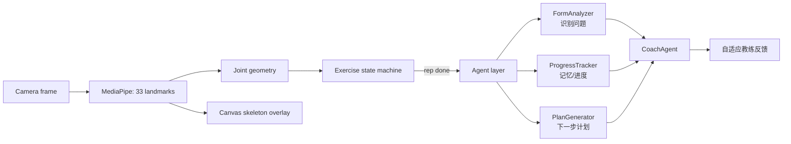

# AIxcellentSport · Agent

> 隐私优先的浏览器端 AI 动作教练 —— 这一仓库是 **Agentic 层（智能体）的独立实验分支**。

AIxcellentSport 在浏览器里用 MediaPipe 检测 33 个身体关键点、测量关节几何、计数动作次数，并把这些动作模式转成可解释的教练提示，**不上传任何摄像头原始帧**。

本仓库在原始项目之上，额外叠加了一层 **Agentic Coaching（智能体教练）**：它带记忆、会调用工具、能跨动作/跨会话做自适应规划。这一层**默认零密钥即可运行**（确定性启发式），一旦配置 LLM 密钥就自动升级为「LLM 驱动」模式。

- 🧠 **记忆层**：只存结构化指标文本，绝不存视频/图像（隐私红线）
- 🛠️ **工具调用**：`assess_form` / `log_rep` / `get_recurring_issues` / `set_goal`
- 🤖 **多智能体编排**：`FormAnalyzer`（感知）→ `ProgressTracker`（记忆）→ `PlanGenerator`（规划），由 `CoachAgent` 统一指挥，并实时渲染「训练报告」
- 🔌 **LLM 可插拔**：OpenAI 兼容协议，内置 **混元Hy3（hunyuan）/ Qwen / DeepSeek / OpenAI** 预设，**不配密钥也能演示**
- 🛡️ **永不翻车**：LLM 超时 / 鉴权失败 / 无网络 → 自动降级为确定性启发式
- 🔊 **语音播报**：教练反馈实时语音读出（浏览器 Web Speech API）
- 🎯 **目标驱动**：设定训练目标，计划生成器据此产出下一步方案
- 🩹 **伤病规避**：标记需规避的部位，相关动作自动禁用、训练计划自动避开
- 📈 **进度可视**：动作质量趋势图 + 结构化训练报告
- 🧩 **动作库**：深蹲 / 俯卧撑 / 开合跳 / 弓步 / 平板支撑，支持多人同框（自动锁定最大目标）

> 这是为「阿里云 Qoder 智能体黑客松」打磨的仓库，专注于 Agentic Coaching（智能体教练）能力，可独立运行、评审、部署。

## 在线演示

```bash
git clone https://github.com/WonderfulClaire/AIxcellentSport-Agent.git
cd AIxcellentSport-Agent
npm ci
npm run dev
```

打开本地 URL，选动作、允许摄像头。**无需任何 API Key 即可看到 Agent 反馈面板**（🤖 Agent 重点）。桌面浏览器 + 摄像头体验最佳。

```bash
npm run check   # lint + 生产构建 + 产品契约测试
```

## 架构



Agent 层数据流（`app/agent/`）：

| 模块 | 职责 |
| --- | --- |
| `index.js` | 统一出口 + LLM 配置解析（含厂商预设 / 超时默认） |
| `coachAgent.js` | 编排核心：评估 → 记忆 → 规划 → 生成反馈（provider-agnostic LLM + 启发式兜底） |
| `multiAgent.js` | 三子智能体协作，输出结构化「训练报告」 |
| `memory.js` | `AgentMemory` 类：localStorage 持久化，结构化指标，跨会话自适应 |
| `tools.js` | 工具注册表（含 JSON schema，供 LLM function calling） |
| `form.js` | 动作质量阈值规则（`assess_form`） |

## 接入 LLM（可选，一行配置）

在 `app/page.tsx` 注入 `window.__AGENT_CONFIG__` 即可，**无需改任何代码**：

```js
// 方式 A：预设厂商（推荐）
window.__AGENT_CONFIG__ = { provider: "hunyuan" };  // 混元Hy3（本仓库即由 WorkBuddy + 混元Hy3 开发）
// window.__AGENT_CONFIG__ = { provider: "qwen" };     // 通义千问 DashScope
// window.__AGENT_CONFIG__ = { provider: "deepseek" };
// window.__AGENT_CONFIG__ = { provider: "openai" };

// 方式 B：OpenAI 兼容直连
window.__AGENT_CONFIG__ = {
  baseUrl: "https://dashscope.aliyuncs.com/compatible-mode/v1",
  apiKey: "sk-xxx",
  model: "qwen-plus",
};
```

不配置 → 自动走确定性启发式（零依赖、零密钥、演示永不翻车）。LLM 调用带 8s 超时，超时即降级，保证演示不卡死。

> 黑客松若要求使用 Qoder / 通义千问平台，把 `provider` 设为 `"qwen"` 即可，无需改动业务代码。

## 测试

```bash
npm run test   # 运行 tests/agent.test.js（记忆 / 工具 / 评估）
```

## 黑客松定位

详见 [`HACKATHON.md`](./HACKATHON.md) —— 本项目的参赛 Pitch、差异化与演示动线。

## License

MIT
