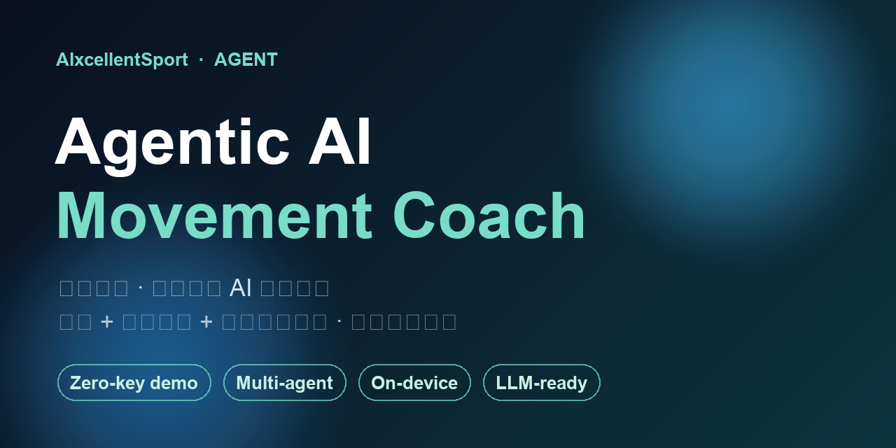
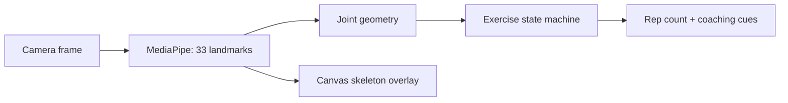
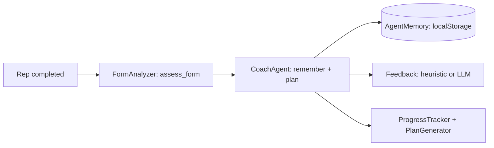

# AIxcellentSport

[](https://github.com/WonderfulClaire/AIxcellentSport/actions/workflows/ci.yml)
[](LICENSE)
[](https://aixcellentsport.cocoa-moth-8728.chatgpt.site)



> Your form, understood. 用浏览器摄像头获得实时、可解释的动作反馈。

AIxcellentSport is a privacy-first AI movement coach that runs in the browser. It detects 33 body landmarks, measures joint geometry, counts repetitions, and turns movement patterns into concise coaching cues—without uploading raw camera frames.

**[Try the live demo](https://aixcellentsport.cocoa-moth-8728.chatgpt.site)** · No account or paid API required. A desktop browser and camera work best.

## Why it exists

Most fitness apps measure duration or repetition count. AIxcellentSport explores a more useful question: **how was the movement performed?** The first release favors transparent geometry and state-machine rules over opaque scores, so contributors can inspect, test, and improve every cue.

## Current capabilities

| Exercise | Rep detection | Current feedback signals |
| --- | --- | --- |
| Squat | Hip/knee movement phases | depth, knee tracking, trunk stability |
| Push-up | Elbow movement phases | range of motion, body-line stability |
| Jumping jack | Arm/leg open-close phases | coordination, range, completion |

- Real-time MediaPipe Pose Landmarker inference
- 33-point skeleton and landmark overlay
- Joint-angle, symmetry, and movement-quality indicators
- **Agentic coaching layer** (`app/agent`): an on-device coach agent with memory, tool use, and planning that adapts feedback across reps and sessions. Runs fully offline (deterministic heuristic) and upgrades to an LLM when a key is configured.
- Local camera processing and responsive Chinese interface
- Graceful camera/model error states

## Quick start

Requirements: Node.js 22.13+

```bash
git clone https://github.com/WonderfulClaire/AIxcellentSport.git
cd AIxcellentSport
npm ci
npm run dev
```

Then open the displayed local URL, select an exercise, and allow camera access. The MediaPipe model and WebAssembly runtime are downloaded on first use.

```bash
npm run check   # lint, production build, and product-contract tests
```

## How it works



The MVP deliberately keeps exercise logic in an explainable rule layer. A future temporal model can improve robustness while retaining rule-based safety checks and visible evidence.

## Agentic coaching layer

AIxcellentSport ships an on-device **coach agent** (`app/agent/`) that turns the per-rep metrics into adaptive, memory-aware feedback — the app is not just a detector, it is an agent.



- **Memory**: `AgentMemory` stores only structured metrics (never video) and surfaces *recurring issues* to set the session focus.
- **Tools**: `assess_form`, `log_rep`, `get_recurring_issues`, `set_goal` — callable by the agent and by LLM function-calling.
- **Planning**: the coach agent decides what to emphasize based on history, then produces the cue.
- **Multi-agent**: `runMultiAgent` orchestrates FormAnalyzer, ProgressTracker, and PlanGenerator for a structured training report.
- **LLM-optional**: the LLM call is OpenAI-compatible (set `window.__AGENT_CONFIG__` with `baseUrl`/`apiKey`/`model`). With no key, a deterministic heuristic runs — so the demo works with zero configuration and never breaks.

See [Architecture](docs/ARCHITECTURE.md) for boundaries and extension points.

## Privacy, safety, and evidence

- Raw camera frames stay in the browser in this version.
- The app does not require an account and does not persist video.
- Feedback is general fitness education, not medical diagnosis.
- Camera angle, occlusion, lighting, and individual anatomy affect results.
- Accuracy claims must include a reproducible dataset, protocol, and report. Historical concept-deck figures are not current MVP evidence.

Please report security or privacy concerns through [GitHub's private security advisory flow](SECURITY.md).

## Roadmap

- [ ] Move inference into a Web Worker
- [ ] Add side-view calibration and more exercise profiles
- [ ] Add local session history and progress trends
- [ ] Support user-calibrated range-of-motion targets
- [ ] Evaluate a temporal movement-quality classifier
- [ ] Extract a community exercise-rule SDK

## Contributing

Issues and pull requests are welcome. New exercises should specify the camera view, phase boundaries, repetition rule, feedback rule, and reproducible edge cases. Read [CONTRIBUTING.md](CONTRIBUTING.md) before opening a pull request.

## License

[MIT](LICENSE)
